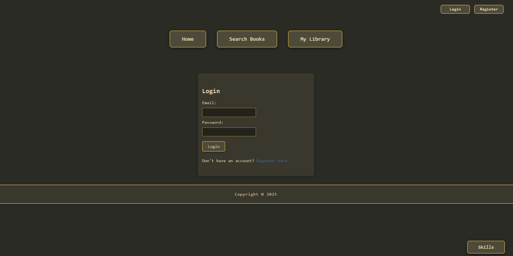
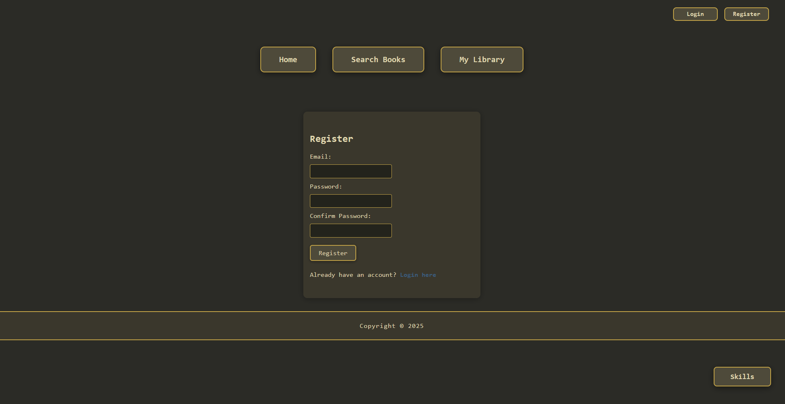
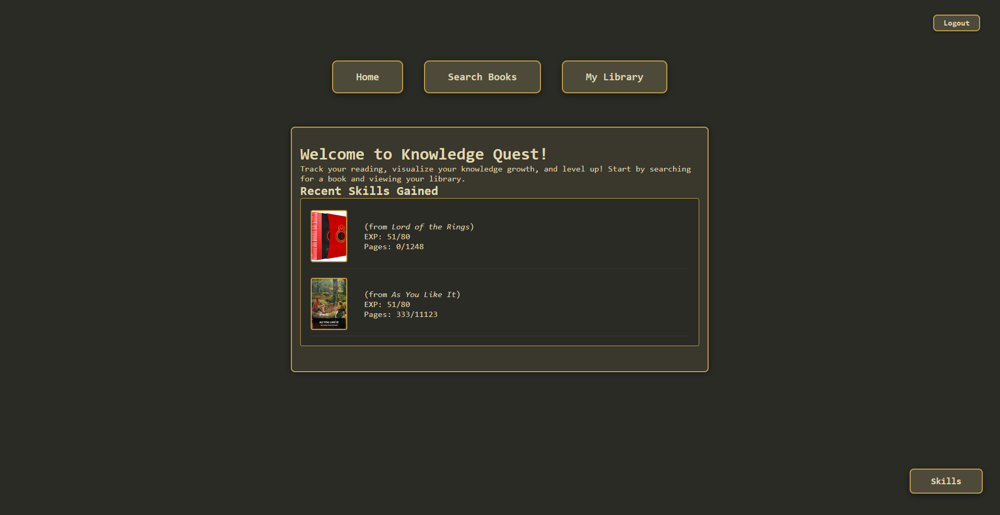
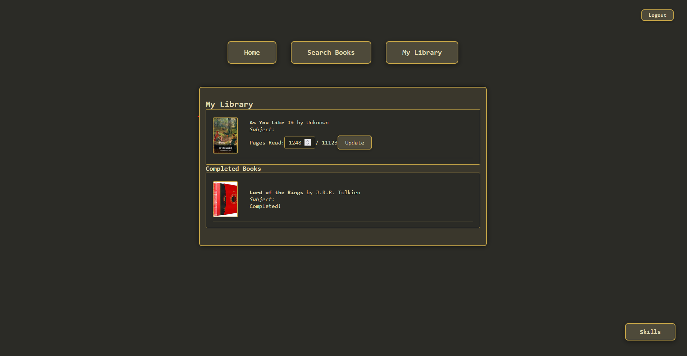
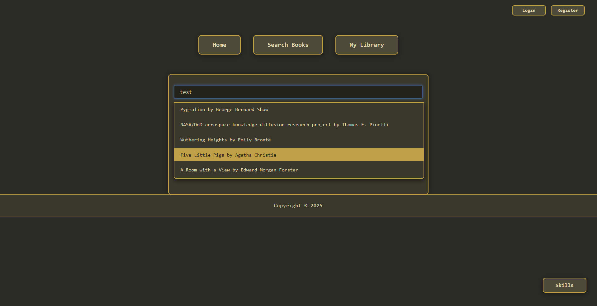

# Knowledge Quest: A Web App Concept to Track How You Grow 

## The Idea
Let's admit it. Learning is hard. And for people whose hobby is learning new things, we can often get side-tracked and forget the last things we were learning. This concept aims to solve part that problem, (mostly my problem) hoarding books I... I mean you'll never read.

## Features
- Search and add books using the OpenLibrary API
- Track your completed books and reading progress
- Automatically fetch book covers, page numbers, and subjects
- Assign EXP to books based on pages read and subject complexity
- Visualize your knowledge growth by subject area
- Store your progress in a relational database for persistence
- User registration and login with secure password hashing
- Session-based authentication using Passport.js
- React SPA Functionality!

## Tech Stack
- PostgreSQL
- ExpressJS
- React
- NodeJS
- Passport.js (authentication)
- bcrypt (password hashing)

## APIs 
- [OpenLibrary](https://openlibrary.org/developers/api) (Covers, Subjects, and Books endpoints)

## How It Works
1. **Search for Books:** Use the app to search for books by title, author, or ISBN.
2. **Add to Your List:** Select books you've completed or are currently reading.
3. **Track Progress:** Log how many pages you've read for each book. Once pages read equals the total pages, the book automatically moves to a "Completed Books" section in your library
4. **Gain EXP:** Each book gives you EXP based on its length and subject complexity.
5. **Visualize Growth:** See charts or stats of your knowledge skills by subject.


## Future Ideas
- User accounts and authentication -- DONE
- Social features (share your progress)
- Recommendations based on your reading history
- More advanced EXP algorithms
- Skill Quizzes on level up 
- Suggesting Personal Projects


## Screenshots
Below are some screenshots showcasing the main features and basic UI Idea of Knowledge Quest. The inspiration for the color scheme is older games like runescape. 

<div align="center">









</div>

## Authentication
Users can register with an email and password. Passwords are securely hashed using bcrypt. After registering or logging in, users can track their reading progress and skills.

## Getting Started
1. Clone the repo
2. Install dependencies:
   ```bash
   npm install
   ```
3. Create a `.env` file in the project root with:
   ```
   SESSION_SECRET=yourSecret
   DB_HOST=localhost
   DB_PORT=5432
   DB_USER=your_db_user
   DB_PASSWORD=your_db_password
   DB_NAME=your_db_name
   ```
4. Set up your PostgreSQL database and configure environment variables
5. Start the server:
   ```bash
   npm start
   ```

---

## License

This project is licensed under the [MIT License](LICENSE).

*This project is a work in progress! Feedback is welcome.*
