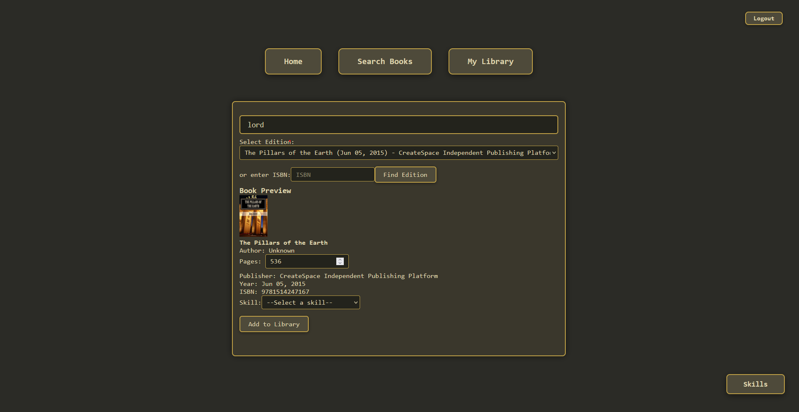

# Knowledge Quest: A Web App Concept to Track How You Grow

## The Idea

Let's admit it. Learning is hard. And for people whose hobby is learning new things, we can often get side-tracked and forget the last things we were learning. This concept aims to solve part that problem, (mostly my problem) hoarding books I... I mean you'll never read.

## Features

- Search and add books using the OpenLibrary API
- Track your completed books and reading progress
- Automatically fetch book covers, page numbers, and subjects
- Assign EXP to books based on pages read and subject complexity
- Visualize your knowledge growth by subject area
- Store your progress in a relational database for persistence
- User registration and login with secure password hashing
- Session-based authentication using Passport.js
- React SPA Functionality!

## Tech Stack

- PostgreSQL
- ExpressJS
- React
- NodeJS
- Passport.js (authentication)
- bcrypt (password hashing)

## APIs

- [OpenLibrary](https://openlibrary.org/developers/api) (Covers, Subjects, and Books endpoints)

## How It Works

1. **Search for Books:** Use the app to search for books by title, author, or ISBN.
2. **Add to Your List:** Select books you've completed or are currently reading.
3. **Track Progress:** Log how many pages you've read for each book. Once pages read equals the total pages, the book automatically moves to a "Completed Books" section in your library
4. **Gain EXP:** Each book gives you EXP based on its length and subject complexity.
5. **Visualize Growth:** See charts or stats of your knowledge skills by subject.

## Future Ideas

- User accounts and authentication -- DONE
- Social features (share your progress)
- Recommendations based on your reading history
- More advanced EXP algorithms
- Skill Quizzes on level up
- Suggesting Personal Projects

## Screenshots

Below are some screenshots showcasing the main features and basic UI Idea of Knowledge Quest. The inspiration for the color scheme is older games like runescape.

<div align="center">




</div>

## Authentication

Users can register with an email and password. Passwords are securely hashed using bcrypt. After registering or logging in, users can track their reading progress and skills.

## Getting Started

Prerequisites

- Node.js (v16+ recommended)
- PostgreSQL
- git

1. Clone the repo

```sh
git clone https://github.com/Banpreet-Aulakh/Knowledge-Quest.git
cd Knowledge-Quest
```

2. Install dependencies

- Install backend deps (root):

```sh
npm install
```

- Install frontend deps:

```sh
npm run install-client
# or
cd frontend && npm install
```

Note: `npm run install-client` runs `cd frontend && npm install` (see [package.json](package.json) and [frontend/package.json](frontend/package.json)).

3. Configure environment
Create a `.env` file in the project root with these variables:

```
SESSION_SECRET=yourSecret
DB_HOST=localhost
DB_PORT=5432
DB_USER=your_db_user
DB_PASSWORD=your_db_password
DB_NAME=your_db_name
```

4. Create database and run schema
Create the database (example using psql), then run the schema:

```sh
# create DB (if not existing)
psql -U $DB_USER -c "CREATE DATABASE $DB_NAME;"

# apply schema
psql -U $DB_USER -d $DB_NAME -f schema.sql
```

See [schema.sql](schema.sql) for table definitions.

5. Run in development
The recommended command starts both backend and frontend development servers concurrently:

```sh
npm run dev
```

- Backend (Express) listens on port 3000 by default: see [backend/index.js](backend/index.js).
- Frontend (Vite) serves the React app (typical dev port 5173). The Vite config proxies API calls to the backend: see [frontend/vite.config.js](frontend/vite.config.js).

You may also run servers separately:

```sh
# backend only
npm run server

# frontend only
cd frontend && npm run dev
```

6. Production build & start

```sh
npm run build       # builds frontend into frontend/dist
npm start           # starts backend (serves frontend/dist and APIs)
```

The backend serves the built React app from `frontend/dist` (see [backend/index.js](backend/index.js)).

Notes / Troubleshooting

- Authentication: the server uses session-based auth with Passport (see [backend/user-accounts.js](backend/user-accounts.js)). The frontend posts credentials to `/login` and `/register`.
- Vite proxy: in dev, POST requests to `/login` and `/register` are proxied to the backend while GET navigation is handled by React Router in the client. If you see 404s for `/login` in dev, ensure the backend is running and check [frontend/vite.config.js](frontend/vite.config.js).
- Database connection errors usually indicate incorrect `.env` settings. Confirm `DB_*` values and that PostgreSQL is running.
- If adding new DB columns/tables, re-run `schema.sql` or apply migrations manually.

## License

This project is licensed under the [MIT License](LICENSE).

*This project is a work in progress! Feedback is welcome.*
